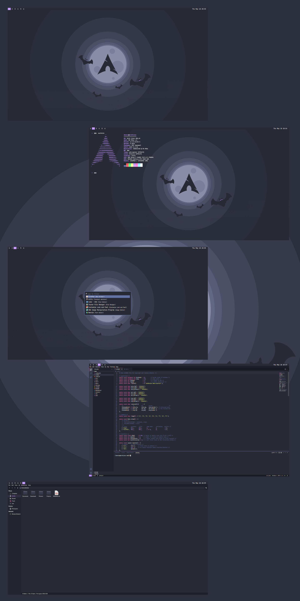

# [dwm] with Dracula color theme

## 🔗 Links
 - [dotfiles](https://github.com/loenard97/dotfiles)
 - [wallpaper](https://github.com/dracula/wallpaper/blob/master/first-collection/arch.png)
 - [Icon Theme](https://draculatheme.com/gtk)
 - [Cursor Theme](https://www.gnome-look.org/p/1669262)
 - [JetBrains Mono](https://www.jetbrains.com/lp/mono/) Font
 - [dwm](https://github.com/loenard97/dwm-fork) (custom fork that only shows workspaces in bar that have a window open like i3-status)
 - [kickstart](https://github.com/nvim-lua/kickstart.nvim) dotfiles for neovim
 - [Dracula color themes](https://draculatheme.com/) for Firefox, VSCode, Rofi and Kitty

## 📸 Screenshots

